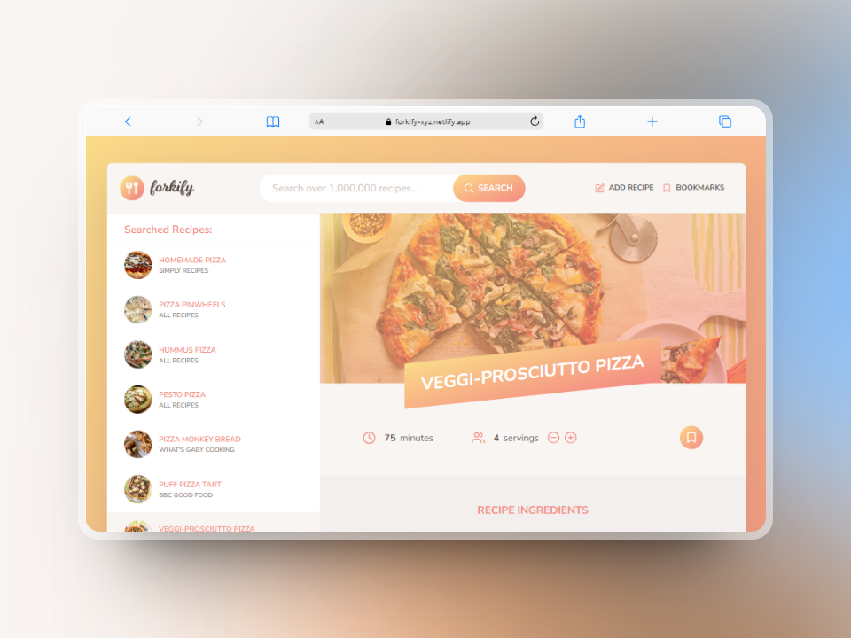

<div id="top"></div>

<div align="center">
  <div>
    
    <p align="center">
      <i align="center">
      Forkify: Your go-to recipe discovery platform for finding and saving delicious recipes. 🍴
      </i
      >
    </p>
  </div>
  <!-- Project Links -->
  <p align="center">
    <br />
    <a href="https://forkify-bharatdua-app.netlify.app/">View Demo</a>
    ·
    <a href="https://github.com/Bharat-Dua/forkify-app/issues" target="_blank">Report Bug</a>
    ·
    <a href="https://github.com/Bharat-Dua/forkify-app/issues" target="_blank">Request Feature</a>
  </p>
  <!-- Badges -->
  <div align="center">
    <!-- Status -->
    <a href="#">
      
    </a>
  </div>



</div>

## 📄 Project Description

Forkify is a web application that streamlines the process of discovering and exploring recipes. It allows users to search for recipes, view detailed ingredients and cooking instructions, bookmark their favorites, and adjust ingredient quantities based on serving size. Built with modern JavaScript tools like Webpack to organize its code and Babel to make sure it works on older browsers, Forkify is designed to be user-friendly for both beginners and experienced cooks, making recipe exploration easy and enjoyable.

## ✨ Features

- **Search and Save Recipes**: Users can search for recipes using keywords or ingredients and save their favorite recipes for easy access later.

- **Adjust Serving Sizes**: This feature allows users to change the number of servings, automatically updating ingredient quantities accordingly.

- **View Nutritional Info**: Users can access detailed nutritional information for each recipe, helping them make informed dietary choices.

- **Access Original Recipe Website**: Users can link directly to the original source of each recipe for additional information or variations.

- **Bookmark Favorite Recipes**: With a single click, users can bookmark recipes, which are easily accessible later.

- **Pagination for Search Results**: Search results are displayed with pagination, allowing users to navigate through multiple pages of results easily.

- **User-Uploaded Recipes**: Users can contribute their own recipes by uploading details and images, expanding the recipe database.

- **Local Storage Integration**: The app utilizes browser local storage to save user bookmarks and preferences, ensuring they are retained across sessions.

## 🛠️ Tech Stack


## 📚 Usage

1. **Open the Application**:  
   Navigate to the deployed version or open the app locally in your web browser at `http://localhost:3000`.

2. **Searching for Recipes**:  
   Use the search bar to enter keywords or ingredients to find recipes. Press enter or click the search button.

3. **Viewing Recipe Details**:  
   Click on any recipe in the search results to view detailed instructions, ingredients, and nutritional information.

4. **Adjusting Serving Sizes**:  
   Use the serving size control (-,+) to adjust the number of servings. The ingredient quantities will update automatically.

5. **Bookmarking Recipes**:  
   Click the bookmark icon on your favorite recipes to save them for easy access later.

6. **Uploading Your Own Recipes**:  
   If you want to contribute, use the "Add Recipe" feature to upload your recipe details and images.

7. **Accessing Bookmarks**:  
   Access all your bookmark recipes, even after closing and reopening the app.

## 📊 Flowchart


## ⬇️ Installation

To run the application locally, follow these steps:

1. Clone the repo
```sh
git clone https://github.com/Bharat-Dua/forkify-app.git
```
2. Go to project folder

```bash
cd forkify
```

3. install dependencies

```bash
npm install
```

4. Start the application

```bash
npm start
```

#### Tree structure

```
forkify
│   .gitignore
│   .prettierrc
|   forkify-architecture-recipe-loading.png
│   forkify-flowchart.png
│   index.html
│   package-lock.json
│   package.json
│   README.md
|   test.js
│
└───src
    ├───img
    │       favicon.png
    │       icons.svg
    │       logo.png
    │       screen.png
    │
    ├───js
    │   │   config.js
    │   │   controller.js
    │   │   helpers.js
    │   │   model.js
    │   │
    │   └───views
    │           addRecipeView.js
    │           bookmarksView.js
    │           paginationView.js
    │           previewView.js
    │           recipeView.js
    │           resultsView.js
    │           searchView.js
    │           View.js
    │
    └───sass
            main.scss
            _base.scss
            _components.scss
            _header.scss
            _preview.scss
            _recipe.scss
            _searchResults.scss
            _upload.scss
```

## 🔗 Reference
API:- Forkify API v2 [API](https://forkify-api.herokuapp.com/v2)

## 🤝 Contributing

Contributions are what make the open source community such an amazing place to learn, inspire, and create. Any contributions you make are **greatly appreciated**.

If you have a suggestion that would make this better, please fork the repo and create a pull request. You can also simply open an issue with the tag "enhancement".
Don't forget to give the project a star! Thanks!

1. Fork the Project
2. Create your Feature Branch (`git checkout -b feature/AmazingFeature`)
3. Commit your Changes (`git commit -m 'Add some AmazingFeature'`)
4. Push to the Branch (`git push origin feature/AmazingFeature`)
5. Open a Pull Request

## Show your support
Give a ⭐️ if you liked this project!